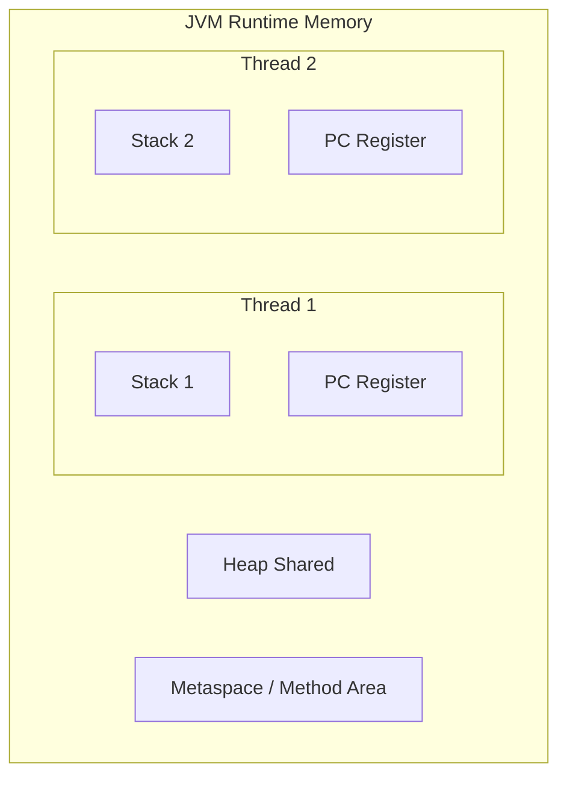
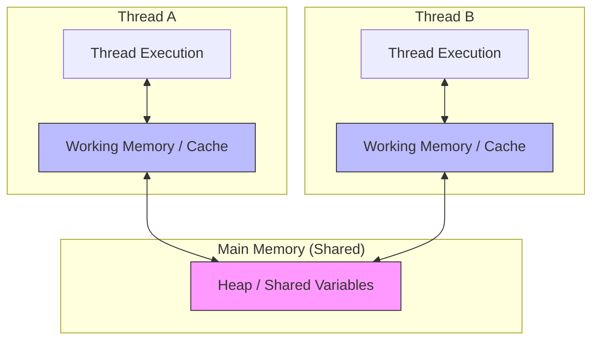

# Concept: JVM Internals & Memory Management

**Status:** High-Frequency Interview Topic
**Focus:** Memory Model (Heap/Stack), Garbage Collection, and Performance Tuning.

---

## 1. JVM Memory Model (The Layout)

The JVM divides memory into two main areas: **Stack** and **Heap**.

### The Stack (Per-Thread)
- Stores local variables and partial results.
- Each thread has its own stack.
- Memory is managed in "frames" (LIFO).
- **Interview Detail:** `StackOverflowError` occurs when the stack is too deep (e.g., infinite recursion).

### The Heap (Shared)
- Stores all objects and arrays.
- Shared across all threads.
- Managed by the **Garbage Collector**.
- **Interview Detail:** `OutOfMemoryError` occurs when the heap is full and the GC cannot reclaim space.

---

## 2. The Java Memory Model (JMM) - Abstract View

While the "Runtime Data Areas" (Heap/Stack) describe the physical layout, the **JMM** describes how threads interact with memory. This is the specification for **Visibility** and **Ordering**.

### Key JMM Concepts for Interviews:
- **Main Memory:** All objects live here.
- **Working Memory:** Each thread has a private copy of the variables it needs (CPU caches/registers).
- **The Visibility Problem:** If Thread A updates a value in its working memory, Thread B might still see the old value in its own working memory unless a **synchronization barrier** (like `volatile` or `synchronized`) forces a flush/refresh from Main Memory.

---

## 3. Heap Generations (Generational Hypothesis)

Java heap is divided into generations because most objects die young.

1.  **Young Generation:**
    - **Eden Space:** New objects created here.
    - **Survivor Spaces (S0, S1):** Objects that survive a "Minor GC" move here.
2.  **Old Generation:**
    - Objects that survive enough minor GCs are "promoted" here.
3.  **Metaspace (Java 8+):**
    - Stores class metadata (replaces PermGen). Uses native memory, not the heap.

---

## 3. Garbage Collection (GC) Algorithms

| GC Collector | Strategy | Use Case |
|---|---|---|
| **Serial GC** | Single-threaded | Small apps, client-side. |
| **Parallel GC** | Multi-threaded (Throughput-focused) | Default in Java 8. Batch processing. |
| **G1 (Garbage First)** | Regionalized (Latency + Throughput) | Default in Java 9+. Large heaps, predictable pauses. |
| **ZGC / Shenandoah** | Concurrent (Ultra-low latency) | Large heaps where <10ms pause is required. |

### The "Stop-the-World" (STW) Pause
A STW event happens when the JVM pauses all application threads to perform GC. 
**Senior Pivot:** How do you minimize STW pauses? (Answer: Choose the right GC, tune `-Xmx` / `-Xms`, and minimize object allocation rates).

---

## 4. The "Senior Pivot" Interview Questions

### Q: "What is the difference between `-Xmx` and `-Xms`?"
**Answer:** `-Xmx` is the maximum heap size; `-Xms` is the initial heap size. For production servers, it's often recommended to set them equal to avoid heap resizing overhead during operation.

### Q: "What is 'Object Promotion' in GC?"
**Answer:** When an object survives multiple rounds of Minor GC in the Young Generation (reaching the "tenuring threshold"), it is promoted to the Old Generation.

### Q: "Explain 'Strong', 'Soft', 'Weak', and 'Phantom' references."
**Answer:**
- **Strong:** Never GC'd until reference is null.
- **Soft:** GC'd only if memory is low.
- **Weak:** GC'd during the next GC cycle (useful for caches like `WeakHashMap`).
- **Phantom:** Used for pre-mortem cleanup (replaces `finalize()`).

### Q: "Why was PermGen replaced by Metaspace?"
**Answer:** PermGen had a fixed size leading to `java.lang.OutOfMemoryError: PermGen space`. Metaspace grows dynamically using native memory, making it more flexible.

---

## Related Topics
- [[java/concepts/synchronization]] — How thread stacks work with monitors.
- [[java/concepts/collections-deep-dive]] — Memory overhead of different collections.
