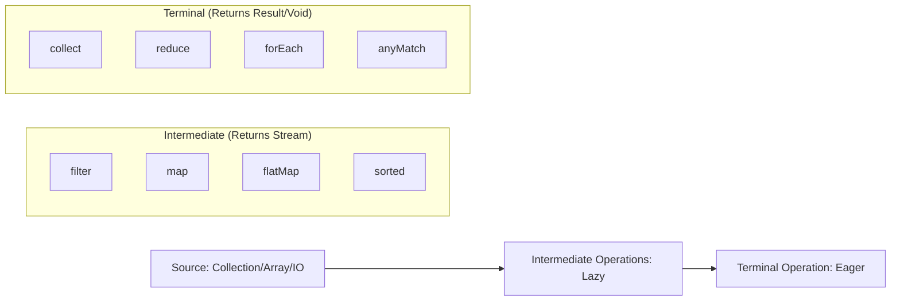

# Concept: Java Streams & Lambda Expressions

**Status:** High-Frequency Interview Topic
**Focus:** Functional Programming, Lazy Evaluation, and Pipeline Processing.

---

## 1. Lambda Expressions & Functional Interfaces

Lambdas (Java 8+) enable functional programming by treating code as data. They are implementations of **Functional Interfaces** (interfaces with exactly one abstract method).

### Common Functional Interfaces
| Interface | Signature | Purpose |
|---|---|---|
| `Predicate<T>` | `boolean test(T t)` | Filtering / Conditions |
| `Function<T, R>` | `R apply(T t)` | Transformation |
| `Consumer<T>` | `void accept(T t)` | Actions / Side-effects |
| `Supplier<T>` | `T get()` | Lazy Generation |

```java
// Lambda Syntax: (parameters) -> { body }
List<String> names = Arrays.asList("Alice", "Bob", "Charlie");

// Using a Predicate
names.removeIf(name -> name.startsWith("A")); 

// Using a Method Reference (Syntactic sugar for Lambdas)
names.forEach(System.out::println); 
```

---

## 2. The Streams API Pipeline

A Stream is a sequence of elements supporting sequential and parallel aggregate operations. It does **not** store data; it carries it through a pipeline.

### The Pipeline Structure


### Code Example: Transformation & Filtering
```java
List<Integer> numbers = Arrays.asList(1, 2, 3, 4, 5, 6);

List<String> result = numbers.stream()
    .filter(n -> n % 2 == 0)          // Intermediate: keep even numbers
    .map(n -> "Even: " + n)          // Intermediate: convert to String
    .limit(2)                        // Intermediate: short-circuiting
    .collect(Collectors.toList());   // Terminal: trigger processing
```

---

## 3. Key Concepts for Seniors

### Lazy Evaluation
Streams are **lazy**. Intermediate operations are not executed until a terminal operation is invoked. This allows for optimizations like **Short-Circuiting** (e.g., `findFirst()` doesn't need to process the whole list).

### `map` vs `flatMap`
- **`map`**: Transforms each element into another element (1-to-1).
- **`flatMap`**: Transforms each element into a stream and flattens multiple streams into one (1-to-many). Use this when dealing with nested collections.

```java
// flatMap example: Flattening a list of lists
List<List<String>> nested = Arrays.asList(Arrays.asList("A"), Arrays.asList("B"));
List<String> flat = nested.stream()
    .flatMap(List::stream)
    .collect(Collectors.toList()); // Result: ["A", "B"]
```

### Parallel Streams
`parallelStream()` uses the **ForkJoinPool.commonPool()**. 
- **Pros:** Can significantly speed up CPU-intensive tasks on large datasets.
- **Cons:** Threading overhead, issues with stateful Lambdas, and potential contention in the common pool. 

---

## 4. The "Senior Pivot" Interview Questions

### Q: "Explain the difference between intermediate and terminal operations."
**Answer:** Intermediate operations return a new Stream and are lazy (e.g., `filter`, `map`). Terminal operations produce a result or side-effect and trigger the execution of the pipeline (e.g., `collect`, `forEach`).

### Q: "What is a 'Stateful' vs 'Stateless' intermediate operation?"
**Answer:** 
- **Stateless:** Can process elements independently (e.g., `filter`, `map`). 
- **Stateful:** Requires knowledge of other elements to proceed (e.g., `distinct`, `sorted`, `limit`). Stateful operations are harder to parallelize effectively.

### Q: "Why should you be careful with `parallelStream()`?"
**Answer:** It uses the shared `ForkJoinPool.commonPool()`. If one task blocks or is very slow, it can starve all other parallel streams in the same JVM. Also, it's only beneficial for large datasets where the computation per element is high enough to outweigh the overhead of splitting and merging.

### Q: "What is the difference between `Stream.of()` and `Collection.stream()`?"
**Answer:** `Collection.stream()` creates a stream from an existing collection. `Stream.of()` creates a stream from discrete values. Note that `Stream.of(myArray)` works as expected, but `Stream.of(myList)` creates a `Stream<List>` rather than a `Stream<Elements>`.

---

## 5. Anticipated Interview Questions (Question Bank)

### 💡 Basic & Intermediate Questions

**Q: Can a Lambda expression access variables outside its scope?**
**A:** Yes, but the variables must be **final or effectively final**. This means their value cannot change after they are initialized. This is because Lambdas "capture" the value, not the reference, to ensure thread safety and predictability.

**Q: What is the difference between `map()` and `peek()`?**
**A:** 
- `map()` is for **transformation** (it returns a Stream of the new type).
- `peek()` is for **debugging/observation** (it returns the same Stream). `peek()` is often ignored by the JVM if the terminal operation doesn't require it (e.g., `count()`), so never use it for production side-effects.

**Q: How do you convert a List to a Map using Streams?**
**A:** Using `Collectors.toMap()`.
```java
Map<Integer, String> map = list.stream()
    .collect(Collectors.toMap(User::getId, User::getName));
```
*Follow-up:* What if there are duplicate keys?
*Answer:* You must provide a "merge function": `Collectors.toMap(User::getId, User::getName, (oldVal, newVal) -> newVal)`.

---

### 🔥 Advanced & Senior Questions

**Q: Why are Streams better than standard for-loops for large data?**
**A:** 
1. **Declarative Style:** Focuses on "what" to do, not "how."
2. **Parallelization:** One line change (`parallelStream()`) can leverage multi-core CPUs.
3. **Pipelining:** Intermediate operations can be fused into a single pass over the data.
4. **Internal Iteration:** The library handles the iteration, allowing for under-the-hood optimizations like lazy evaluation and short-circuiting.

**Q: Explain the "Short-circuiting" behavior in Streams.**
**A:** Short-circuiting operations allow a pipeline to complete without processing all elements. 
- *Intermediate:* `limit(n)`.
- *Terminal:* `findFirst()`, `anyMatch()`, `allMatch()`.
*Example:* `stream.filter(x -> x > 10).findFirst()` stops as soon as the first element > 10 is found.

**Q: What is the output of this code?**
```java
Stream.of("A", "B", "C")
    .filter(s -> {
        System.out.println("Filter: " + s);
        return true;
    })
    .forEach(s -> System.out.println("ForEach: " + s));
```
**A:** It will print interleaved: `Filter: A`, `ForEach: A`, `Filter: B`, `ForEach: B`, etc. This demonstrates that Streams process elements one by one through the pipeline (vertically) rather than completing one whole operation for all elements before moving to the next (horizontally).

**Q: How does `reduce()` differ from `collect()`?**
**A:** 
- `reduce()` is for **combining** elements into a single value (e.g., sum, max). It usually works with immutable values.
- `collect()` is for **mutating** a container (e.g., adding to a `List` or `StringBuilder`). It is more efficient for collections because it avoids creating new container objects at every step.

---

### 🛠️ Scenario-Based Coding Questions

**Scenario 1: Grouping Data**
*"Given a list of Employees, how do you group them by Department and find the average salary in each department?"*
```java
Map<String, Double> avgSalaryByDept = employees.stream()
    .collect(Collectors.groupingBy(
        Employee::getDepartment,
        Collectors.averagingDouble(Employee::getSalary)
    ));
```

**Scenario 2: Finding Maximums**
*"How do you find the longest string in a list using Streams?"*
```java
Optional<String> longest = list.stream()
    .max(Comparator.comparingInt(String::length));
```

**Scenario 3: Flatting and Distinct**
*"You have a list of Orders, each containing a list of Items. Get a unique list of all Item names across all orders."*
```java
List<String> uniqueItems = orders.stream()
    .flatMap(order -> order.getItems().stream())
    .map(Item::getName)
    .distinct()
    .collect(Collectors.toList());
```

---

## Related Topics
- [[java/concepts/synchronization]] — Thread safety issues in parallel streams.
- [[java/concepts/collections-deep-dive]] — The sources for most streams.
