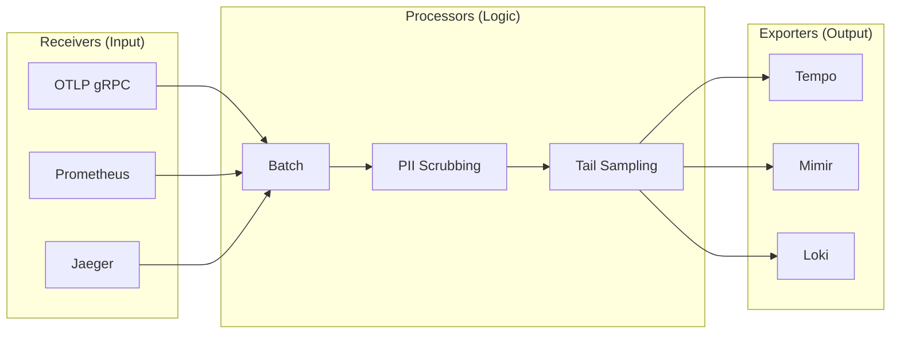
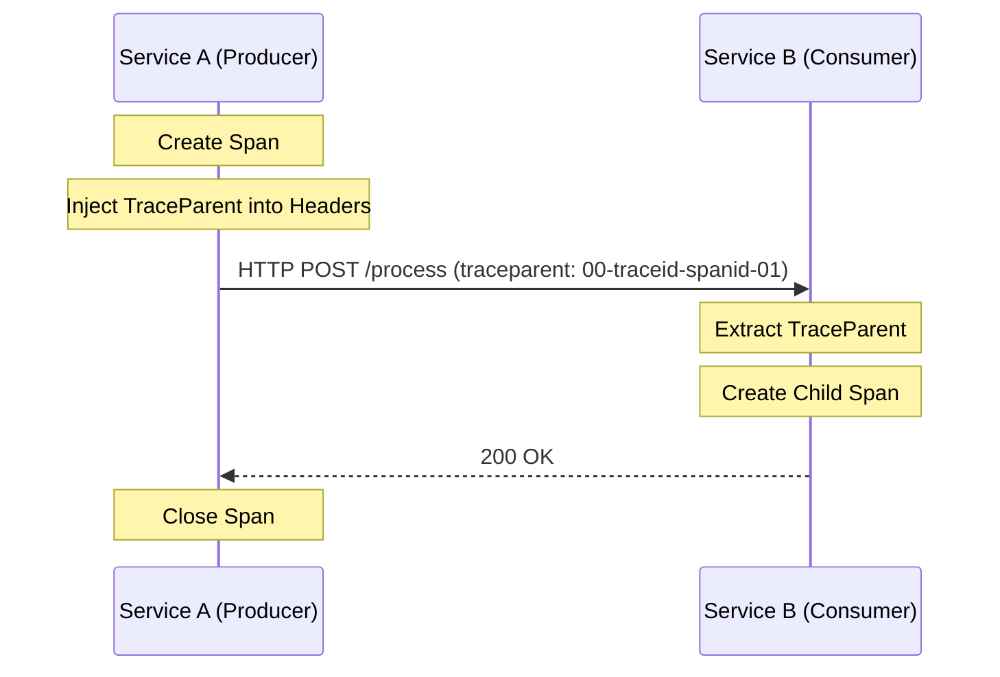

# OpenTelemetry (OTel)

**Topic:** [[obs/topics/tracing]], [[obs/topics/metrics]], [[obs/topics/logging]]
**Related:** [[obs/concepts/tempo-jaeger]], [[obs/concepts/prometheus]], [[obs/concepts/sampling]]

---

## The OTel Collector Architecture

The Collector is a vendor-neutral proxy that can receive, process, and export telemetry data.



---

## Context Propagation

How Trace IDs travel across network boundaries:



---

## What it is

OpenTelemetry is the **CNCF standard for observability instrumentation**. It provides:
- A unified API + SDK for emitting metrics, logs, and traces (the three pillars + profiling).
- A vendor-neutral wire protocol (**OTLP**: OpenTelemetry Protocol).
- A **Collector** — an agent/gateway that receives, processes, and exports telemetry to any backend.

Before OTel: every vendor had its own SDK (Datadog agent, Jaeger client, Prometheus client). Switching backends required rewriting instrumentation. OTel decouples instrumentation from backends.

```
Application code
     │
     │ OTel SDK (one API)
     ▼
OTel Collector ──► Prometheus (metrics)
                ──► Tempo / Jaeger (traces)
                ──► Loki / Elasticsearch (logs)
                ──► Datadog / NewRelic (SaaS)
```

---

## The Three Signals (OTel Terminology)

| Signal | OTel API | Wire protocol | Common backends |
|---|---|---|---|
| Traces | `trace.Tracer` | OTLP/gRPC or OTLP/HTTP | Tempo, Jaeger, Datadog APM |
| Metrics | `metrics.Meter` | OTLP, Prometheus remote write | Prometheus, Datadog, Mimir |
| Logs | `log.Logger` | OTLP | Loki, Elasticsearch, Datadog |

OTel's biggest win: **all three signals share the same context** (trace_id, span_id, resource attributes). A log emitted inside a traced span automatically carries the trace_id — no manual correlation needed.

---

## Key Concepts

### Resource
Describes the entity producing telemetry — the service, its version, the host, the deployment environment.

```python
from opentelemetry.sdk.resources import Resource

resource = Resource.create({
    "service.name":    "checkout-service",
    "service.version": "1.4.2",
    "deployment.environment": "production",
    "host.name":       os.uname().nodename,
    "cloud.provider":  "aws",
    "cloud.region":    "us-east-1",
})
```

Resource attributes appear on all spans, metrics, and logs from this instance — they're the "who" of the telemetry.

### Span Attributes
Per-span key-value tags describing the specific operation. Follow **semantic conventions**:

```python
# HTTP server span
span.set_attribute("http.method", "POST")
span.set_attribute("http.url", "/api/checkout")
span.set_attribute("http.status_code", 200)
span.set_attribute("http.request_content_length", 1024)

# Database span
span.set_attribute("db.system", "postgresql")
span.set_attribute("db.name", "orders")
span.set_attribute("db.operation", "SELECT")
span.set_attribute("db.statement", "SELECT * FROM orders WHERE user_id = ?")  # parameterized only!
```

**Semantic conventions** are OTel-defined standard attribute names. Using them ensures compatibility with backends and reduces confusion across teams.

### Context Propagation
Context propagation is how trace IDs flow from service to service.

```python
from opentelemetry.propagate import inject, extract
from opentelemetry import context

# PRODUCER: Inject context into outgoing HTTP headers
headers = {}
inject(headers)  # adds traceparent, tracestate
response = requests.post("http://payment-svc/charge", headers=headers, json=payload)

# CONSUMER: Extract context from incoming headers
ctx = extract(request.headers)
with tracer.start_as_current_span("handle_charge", context=ctx):
    process_charge()
```

---

## OTel SDK Setup (Python)

```python
from opentelemetry import trace, metrics
from opentelemetry.sdk.trace import TracerProvider
from opentelemetry.sdk.trace.export import BatchSpanProcessor
from opentelemetry.exporter.otlp.proto.grpc.trace_exporter import OTLPSpanExporter
from opentelemetry.sdk.metrics import MeterProvider
from opentelemetry.exporter.otlp.proto.grpc.metric_exporter import OTLPMetricExporter
from opentelemetry.sdk.metrics.export import PeriodicExportingMetricReader
from opentelemetry.sdk.resources import Resource

# 1. Define resource
resource = Resource.create({"service.name": "checkout-service", "service.version": "1.4.2"})

# 2. Setup tracing
tracer_provider = TracerProvider(resource=resource)
tracer_provider.add_span_processor(
    BatchSpanProcessor(OTLPSpanExporter(endpoint="http://otel-collector:4317"))
)
trace.set_tracer_provider(tracer_provider)
tracer = trace.get_tracer("checkout-service")

# 3. Setup metrics
metric_reader = PeriodicExportingMetricReader(
    OTLPMetricExporter(endpoint="http://otel-collector:4317"),
    export_interval_millis=15000  # export every 15s
)
meter_provider = MeterProvider(resource=resource, metric_readers=[metric_reader])
metrics.set_meter_provider(meter_provider)
meter = metrics.get_meter("checkout-service")

# 4. Create instruments
request_counter = meter.create_counter(
    "http.requests.total",
    unit="1",
    description="Total HTTP requests"
)
request_duration = meter.create_histogram(
    "http.request.duration",
    unit="s",
    description="HTTP request duration"
)

# 5. Instrument a function
def handle_checkout(order_id: str) -> dict:
    with tracer.start_as_current_span("checkout") as span:
        span.set_attribute("order.id", order_id)
        start = time.time()
        try:
            result = process_order(order_id)
            request_counter.add(1, {"method": "POST", "status": "200"})
            return result
        except Exception as e:
            span.record_exception(e)
            span.set_status(trace.StatusCode.ERROR)
            request_counter.add(1, {"method": "POST", "status": "500"})
            raise
        finally:
            request_duration.record(time.time() - start, {"endpoint": "/checkout"})
```

---

## Auto-Instrumentation

For popular frameworks, OTel provides zero-code instrumentation:

```bash
# Install auto-instrumentation packages
pip install opentelemetry-instrumentation-fastapi \
            opentelemetry-instrumentation-sqlalchemy \
            opentelemetry-instrumentation-redis \
            opentelemetry-instrumentation-requests

# Run with auto-instrumentation
opentelemetry-instrument \
  --traces_exporter otlp \
  --metrics_exporter otlp \
  --logs_exporter otlp \
  --exporter_otlp_endpoint http://otel-collector:4317 \
  uvicorn app:main
```

Auto-instrumentation covers: every HTTP request/response, every SQLAlchemy query (with parameterized SQL), every Redis command, every outbound `requests` call. ~90% of the observable surface without writing code.

**Kubernetes: OTel Operator**
The OTel Operator for Kubernetes injects auto-instrumentation sidecars at pod creation time via a webhook — no application code changes at all:

```yaml
apiVersion: opentelemetry.io/v1alpha1
kind: Instrumentation
metadata:
  name: python-instrumentation
spec:
  traces:
    sampler:
      type: parentbased_traceidratio
      argument: "0.1"   # 10% head sampling
  exporter:
    endpoint: http://otel-collector:4317
  python:
    image: ghcr.io/open-telemetry/opentelemetry-operator/autoinstrumentation-python:latest
---
# Annotate the deployment to opt in
# metadata.annotations:
#   instrumentation.opentelemetry.io/inject-python: "true"
```

---

## The OTel Collector

The Collector is an optional but highly recommended component — a vendor-neutral telemetry pipeline.

```yaml
# otel-collector-config.yaml
receivers:
  otlp:
    protocols:
      grpc:
        endpoint: 0.0.0.0:4317
      http:
        endpoint: 0.0.0.0:4318
  prometheus:
    config:
      scrape_configs:
        - job_name: 'app'
          static_configs:
            - targets: ['localhost:8000']

processors:
  batch:
    timeout: 10s
    send_batch_size: 1024
  memory_limiter:
    limit_mib: 512
  tail_sampling:                    # buffer traces, sample at end
    decision_wait: 30s
    policies:
      - name: errors-policy
        type: status_code
        status_code: {status_codes: [ERROR]}
      - name: slow-traces-policy
        type: latency
        latency: {threshold_ms: 500}
      - name: probabilistic-policy
        type: probabilistic
        probabilistic: {sampling_percentage: 1}

exporters:
  otlp/tempo:
    endpoint: tempo:4317
    tls:
      insecure: true
  prometheusremotewrite:
    endpoint: http://prometheus:9090/api/v1/write
  loki:
    endpoint: http://loki:3100/loki/api/v1/push

service:
  pipelines:
    traces:
      receivers:  [otlp]
      processors: [batch, memory_limiter, tail_sampling]
      exporters:  [otlp/tempo]
    metrics:
      receivers:  [otlp, prometheus]
      processors: [batch, memory_limiter]
      exporters:  [prometheusremotewrite]
    logs:
      receivers:  [otlp]
      processors: [batch]
      exporters:  [loki]
```

**Collector benefits:**
- Tail sampling (requires stateful buffering — must run in Collector, not the app SDK)
- Centralized configuration: change backends without redeploying applications
- Buffering and retry on backend failures
- Data transformation (attribute renaming, PII scrubbing)
- Protocol translation (OTLP → Prometheus remote write, OTLP → Zipkin)

---

## OTLP (OpenTelemetry Protocol)

OTLP is the wire protocol. Supports:
- **gRPC** (port 4317): streaming, efficient, preferred for high volume
- **HTTP/protobuf** (port 4318): simpler, works through HTTP proxies
- **HTTP/JSON** (port 4318): human-readable, useful for debugging

---

## Interview Questions

**Q: What is the difference between OTel and Prometheus?**
A: Prometheus is a monitoring system (pull-based scrape + TSDB + PromQL). OTel is an instrumentation standard — it defines how applications emit telemetry and provides a Collector to route it to any backend. OTel metrics can be exported to Prometheus. They complement each other.

**Q: Why use the OTel Collector instead of exporting directly from the app?**
A: The Collector provides: (1) tail sampling (requires buffering all trace data, can't do in app SDK); (2) buffering/retry on backend failures; (3) centralized config (change backends without redeploying apps); (4) PII scrubbing/data transformation before export.

**Q: What is the difference between head sampling and tail sampling?**
A: Head sampling decides at the start of a request whether to trace it — before the outcome is known. Simple but misses rare errors in the non-sampled fraction. Tail sampling buffers all trace data for the request, waits for completion, then decides — allowing 100% sampling of errors and slow traces. Tail sampling requires the OTel Collector (the app SDK doesn't have the buffer). [[obs/concepts/sampling]]

**Q: How do you instrument a service that calls another via a message queue?**
A: Inject the OTel context (trace parent) into the message payload or headers. The consumer extracts it and creates a child span. OTel has propagators built for Kafka, SQS, RabbitMQ, and Pub/Sub.

## Sources
- [[obs/sources/opentelemetry-spec]]
- [[obs/concepts/tempo-jaeger]]
- [[obs/concepts/sampling]]
