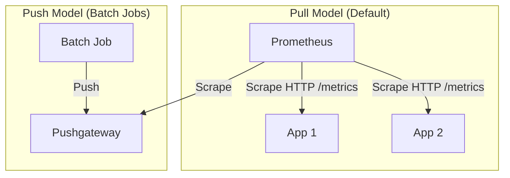
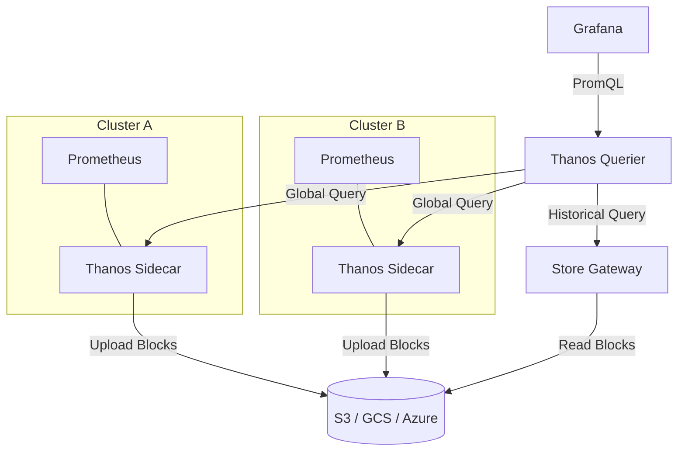

# Prometheus

**Topic:** [[obs/topics/metrics]]
**Related:** [[obs/concepts/grafana]], [[obs/concepts/cardinality]], [[obs/patterns/four-golden-signals]]

---

## Scrape Models: Pull vs Push

Prometheus is primarily a **Pull-based** system, but can handle push via a gateway.



---

## High Availability & Long-Term Storage (Thanos)

Thanos extends Prometheus to provide global query and unlimited retention.



---

## What it is

Prometheus is an open-source time-series monitoring system and alerting toolkit. It is the de-facto standard for Kubernetes and cloud-native metrics. Originally built at SoundCloud; now a CNCF graduated project.

**Core model:** Prometheus **pulls** (scrapes) metrics from target HTTP endpoints at regular intervals (default: 15s). Targets expose metrics at `/metrics` in Prometheus exposition format.

---

## Architecture

```
┌─────────────────────────────────────────────────────────────────┐
│                         Prometheus Server                        │
│                                                                  │
│  Retrieval    ──────────────►  TSDB (local disk, 15-day default) │
│  (scrape loop)                                                   │
│       │                          ▲                               │
│       │    Service Discovery     │  PromQL query engine          │
│       ▼    (K8s, Consul, DNS,    │                               │
│  Target pool  static config)     │                               │
└──────────────────────────────────────────────────────────────────┘
         │                              ▲
         │ scrape /metrics              │ query
         ▼                              │
  App instances              ┌──────────┴──────────┐
  (exporters)                │      Grafana         │
                             │   (visualization)    │
                             └─────────────────────┘
                                        │
                             ┌──────────▼──────────┐
                             │   Alertmanager       │
                             │   (route+notify)     │
                             └─────────────────────┘
```

**Pushgateway:** For short-lived jobs (batch, cron) that can't be scraped, push metrics to the Pushgateway, which Prometheus scrapes. Not for long-running services.

---

## Data Model

Every time series is uniquely identified by its **metric name** + **label set**:

```
http_requests_total{method="GET", status="200", service="api", pod="api-xyz-123"} 15234 1714512000
│                  │────────────────────────────────────────────────────────────│ │────│ │────────│
│ metric name      │                        labels                               │ value  timestamp
```

**Metric naming convention:** `<namespace>_<subsystem>_<name>_<unit>`
```
http_requests_total              ← counter: unit "total" implicit
http_request_duration_seconds    ← histogram: unit in name
node_memory_available_bytes      ← gauge: unit in name
process_open_fds                 ← gauge: no unit (count)
```

---

## Metric Types (Implementation)

### Counter (client library → Prometheus)
```python
from prometheus_client import Counter, start_http_server

requests_total = Counter(
    'http_requests_total',
    'Total HTTP requests',
    ['method', 'status', 'endpoint']
)

def handle_request(method, endpoint):
    try:
        result = process()
        requests_total.labels(method=method, status='200', endpoint=endpoint).inc()
        return result
    except Exception:
        requests_total.labels(method=method, status='500', endpoint=endpoint).inc()
        raise
```

### Histogram (client library)
```python
from prometheus_client import Histogram
import time

request_duration = Histogram(
    'http_request_duration_seconds',
    'HTTP request duration',
    ['method', 'endpoint'],
    buckets=[0.005, 0.01, 0.025, 0.05, 0.1, 0.25, 0.5, 1, 2.5, 5, 10]
)

with request_duration.labels(method='GET', endpoint='/api/users').time():
    result = handle_request()
```

**Bucket selection matters.** Choose buckets that align with your SLO thresholds. If your SLO is p99 < 500ms, you need buckets at 0.1, 0.25, 0.5, 1.0 to compute it accurately.

---

## PromQL Deep Dive

### Selectors
```promql
# Exact match
http_requests_total{status="200"}

# Regex match
http_requests_total{status=~"2..|3.."}

# Negative match
http_requests_total{status!="500"}

# Negative regex
http_requests_total{pod!~"test-.*"}
```

### Range Vectors and Functions
```promql
# Rate: per-second rate over 5-minute window
rate(http_requests_total[5m])

# Increase: total increase over window (for display)
increase(http_requests_total[1h])

# irate: per-second rate based on last 2 data points (responsive but spiky)
irate(http_requests_total[5m])

# Delta: change in gauge over window
delta(node_memory_available_bytes[10m])

# Deriv: per-second derivative of gauge (rate of change)
deriv(node_disk_usage_bytes[10m])
```

### Aggregations
```promql
# Sum across all pods in a namespace
sum by (namespace) (rate(http_requests_total[5m]))

# Sum without pod label (preserve all other labels)
sum without (pod) (rate(http_requests_total[5m]))

# Average CPU across nodes
avg by (node) (rate(container_cpu_usage_seconds_total[5m]))

# Top 5 consumers
topk(5, rate(http_requests_total[5m]))

# Count of series matching selector
count(up{job="node-exporter"})
```

### The 4 Golden Signal Queries
```promql
# 1. Traffic (requests per second)
sum(rate(http_requests_total[5m])) by (service)

# 2. Errors (fraction of requests that are 5xx)
sum(rate(http_requests_total{status=~"5.."}[5m])) by (service)
/
sum(rate(http_requests_total[5m])) by (service)

# 3. Latency (p99 across all pods)
histogram_quantile(0.99,
  sum by (le, service) (
    rate(http_request_duration_seconds_bucket[5m])
  )
)

# 4. Saturation (CPU throttling)
sum by (pod) (
  rate(container_cpu_cfs_throttled_periods_total[5m])
  /
  rate(container_cpu_cfs_periods_total[5m])
)
```

### Common Patterns
```promql
# Error budget remaining (for a 99.9% SLO)
1 - (
  sum(rate(http_requests_total{status=~"5.."}[30d]))
  /
  sum(rate(http_requests_total[30d]))
) / 0.001

# Apdex score (fraction of requests within threshold)
(
  sum(rate(http_request_duration_seconds_bucket{le="0.3"}[5m]))
  +
  sum(rate(http_request_duration_seconds_bucket{le="1.2"}[5m]))
) / 2
/
sum(rate(http_request_duration_seconds_count[5m]))

# Memory usage % per pod
container_memory_working_set_bytes
  /
container_spec_memory_limit_bytes
* 100
```

---

## Alerting Rules

```yaml
# rules/api-alerts.yaml
groups:
  - name: api-slo-alerts
    interval: 30s           # how often to evaluate these rules
    rules:
      # Recording rule: precompute error ratio (reusable in multiple alerts)
      - record: job:http_error_ratio:rate5m
        expr: |
          sum(rate(http_requests_total{status=~"5.."}[5m])) by (job)
          /
          sum(rate(http_requests_total[5m])) by (job)

      # Alert: burn rate is too fast
      - alert: APIHighErrorBurnRate
        expr: |
          job:http_error_ratio:rate5m{job="api"} > 0.001 * 14.4
        for: 5m
        labels:
          severity: critical
          team: platform
        annotations:
          summary: "API error budget burning at {{ $value | humanizePercentage }} rate"
          description: "SLO burn rate exceeds 14.4x. Current error rate: {{ $value }}"
          runbook_url: "https://runbooks.internal/api-high-error-rate"
          dashboard_url: "https://grafana.internal/d/api-overview"
```

---

## Federation and Long-Term Storage

### Problem with Default Prometheus
- Local TSDB: default 15-day retention.
- No horizontal scaling: single server handles all scraping.
- No cross-cluster querying.

### Solution: Thanos

```
┌──────────────────────────────────────────────────────────────────┐
│  Cluster A             Cluster B             Cluster C            │
│  Prometheus + Sidecar  Prometheus + Sidecar  Prometheus + Sidecar│
│        │                     │                     │              │
│        └─────────────────────┼─────────────────────┘              │
│                              │ Upload 2h blocks                   │
│                              ▼                                    │
│                    ┌─────────────────┐                            │
│                    │   Object Store  │  (S3/GCS/Azure)           │
│                    │  (long-term)    │  unlimited retention       │
│                    └─────────┬───────┘                            │
│                              │                                    │
│                    ┌─────────▼───────┐                            │
│                    │  Thanos Query   │  PromQL across all         │
│                    │  (global view)  │  clusters + long-term      │
│                    └─────────────────┘                            │
└──────────────────────────────────────────────────────────────────┘
```

**Key Thanos components:**
- **Sidecar:** Runs alongside Prometheus; ships 2-hour TSDB blocks to object store.
- **Store Gateway:** Reads blocks from object store; answers range queries on historical data.
- **Querier:** Merges results from Sidecars (recent) + Store Gateways (historical). Handles deduplication.
- **Compactor:** Compacts and downsamples old blocks (5m and 1h resolution) to reduce query cost.
- **Ruler:** Evaluates alerting and recording rules across global data.

---

## Kubernetes Exporters (Must Know)

| Exporter | Metrics exposed | Key labels |
|---|---|---|
| **kube-state-metrics** | K8s object state (deployment replicas, pod status) | namespace, pod, deployment |
| **node-exporter** | OS/hardware: CPU, memory, disk, network | node, instance |
| **cadvisor** | Container resource usage (bundled in kubelet) | pod, container, namespace |
| **blackbox-exporter** | Probe HTTP/TCP/ICMP endpoints | instance, module |
| **process-exporter** | Per-process metrics | groupname, pid |

**Critical query:** "Is my pod being CPU throttled?"
```promql
rate(container_cpu_cfs_throttled_periods_total{container!=""}[5m])
/
rate(container_cpu_cfs_periods_total{container!=""}[5m])
> 0.25   -- alert if >25% of scheduling periods are throttled
```

---

## Interview Questions

**Q: Why does Prometheus use pull (scrape) instead of push?**
A: Pull has significant advantages: (1) the monitoring system knows if a target is unreachable (push-based systems can silently miss targets); (2) multiple Prometheus instances can scrape the same target without coordination; (3) you can test your metrics endpoint with curl. Downside: requires service discovery and network reachability from Prometheus to targets.

**Q: What is a recording rule and why use it?**
A: A recording rule precomputes an expensive PromQL expression and stores the result as a new time series. Queries that would scan 1M data points can instead scan 1K precomputed points. Critical for dashboards and SLO calculations that run constantly.

**Q: How does Prometheus handle high availability?**
A: Run two identical Prometheus instances scraping the same targets. Thanos Querier or Cortex deduplicate the identical series at query time. There is no leader election — both instances run independently.

**Q: What is the `up` metric?**
A: Prometheus records `up{job="...", instance="..."}=1` if the last scrape succeeded, `0` if it failed. The query `count(up == 0)` tells you how many targets are currently down.

## Sources
- [[obs/sources/prometheus-docs]]
- [[obs/concepts/cardinality]]
- [[obs/patterns/four-golden-signals]]
