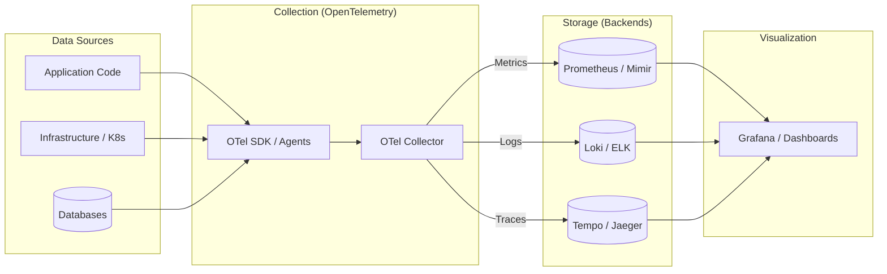
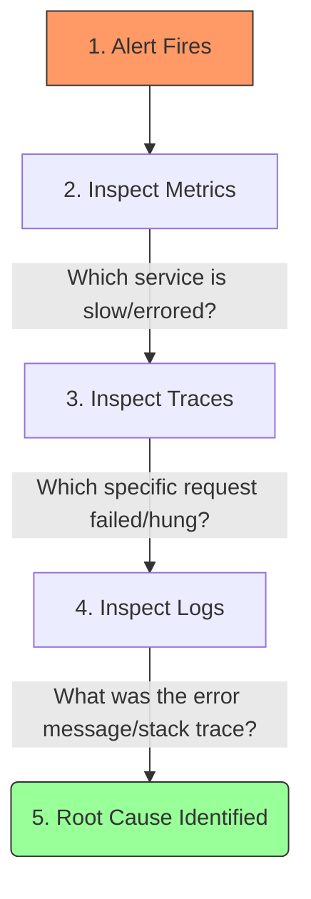

# Observability — Overview

## What is Observability?

**Observability** is the property of a system that lets you understand its internal state from external outputs alone — without deploying new code or connecting a debugger.

Borrowed from control theory: a system is observable if its current state can be determined from knowledge of its outputs over time.

> [!TIP]
> **Monitoring ≠ Observability.** Monitoring tells you **when** something is broken (The "What"). Observability tells you **why** (The "Root Cause").

---

## The Observability Data Flow

How telemetry travels from your code to your eyes:



---

## The Three Pillars

```
         ┌─────────────────────────────────────────────────────────┐
         │                    Observability                        │
         │                                                         │
         │  ┌─────────────┐  ┌─────────────┐  ┌───────────────┐  │
         │  │   METRICS   │  │    LOGS     │  │   TRACES      │  │
         │  │             │  │             │  │               │  │
         │  │ What is the │  │ What events │  │ Where is the  │  │
         │  │ system doing│  │ happened?   │  │ latency?      │  │
         │  │ right now?  │  │ (context)   │  │ (causality)   │  │
         │  │             │  │             │  │               │  │
         │  │ Prometheus  │  │ Loki / ELK  │  │ Tempo / Jaeger│  │
         │  └─────────────┘  └─────────────┘  └───────────────┘  │
         └─────────────────────────────────────────────────────────┘
                                    │
                        ┌───────────▼───────────┐
                        │  OpenTelemetry (OTel)  │
                        │  Standard SDK + OTLP   │
                        │  one API, any backend  │
                        └───────────────────────┘
```

| Pillar | Question answered | Granularity | Storage | Cost |
|---|---|---|---|---|
| **Metrics** | How is the system performing? | Aggregated (1-min samples) | Time-series DB | Low |
| **Logs** | What happened and why? | Per-event | Log store | High |
| **Traces** | Which service is slow? | Per-request | Object storage | Medium |

> [!NOTE]
> A fourth pillar is increasingly recognized: **Profiling** (continuous CPU/memory flame graphs per service). Tools: Parca, Pyroscope, Google Cloud Profiler.

---

## The Observability Maturity Model

| Level | Capability | Tooling |
|---|---|---|
| **0 – None** | SSH in, grep logs manually | Nothing |
| **1 – Basic Monitoring** | Uptime checks, server metrics | Nagios, CloudWatch basics |
| **2 – Metrics + Alerts** | Service-level metrics, threshold alerts | Prometheus + Alertmanager |
| **3 – Structured Logging** | Queryable logs, log-based alerting | Loki / ELK |
| **4 – Distributed Tracing** | Cross-service request tracking | Jaeger / Tempo |
| **5 – Full Observability** | Correlated signals, SLO-based alerting, OTel | Full LGTM or Datadog stack |

---

## The Troubleshooting Workflow (The "Golden Path")

When an incident occurs, this is how you use the signals to resolve it:



---

## Coverage Map

| Topic | Pages | Status |
|---|---|---|
| Metrics fundamentals | [[obs/topics/metrics]] | Done |
| Prometheus deep dive | [[obs/concepts/prometheus]] | Done |
| OpenTelemetry | [[obs/concepts/opentelemetry]] | Done |
| Logging | [[obs/topics/logging]], [[obs/concepts/loki]] | Done |
| Distributed Tracing | [[obs/topics/tracing]], [[obs/concepts/tempo-jaeger]] | Done |
| Alerting | [[obs/topics/alerting]], [[obs/patterns/alert-routing]] | Done |
| SLO / Burn Rate | [[obs/concepts/slo-burn-rate]] | Done |
| Cardinality | [[obs/concepts/cardinality]] | Done |
| eBPF | [[obs/concepts/ebpf-observability]] | Done |
| Dashboard design | [[obs/patterns/dashboard-design]] | Done |
| Debugging scenarios | [[obs/scenarios/high-latency-no-errors]], etc. | Done |
| Company-specific | Google, Meta, Apple | Done |

---

## How to Use This KB

**For a system design round (observability of your system):**
1. Propose the **Four Golden Signals** → [[obs/patterns/four-golden-signals]]
2. Define **SLOs and error budgets** → [[obs/concepts/slo-burn-rate]]
3. Describe the **alert routing** → [[obs/patterns/alert-routing]]
4. Describe the **debug story** (metrics → traces → logs) → [[obs/overview]] above

**For a troubleshooting round:**
1. Start with **USE method** (resource bottleneck) → [[obs/patterns/red-use-method]]
2. Use **scenarios** as practice → [[obs/scenarios/high-latency-no-errors]]

**For a coding/tool round:**
1. **PromQL** fluency → [[obs/concepts/prometheus]]
2. **LogQL** for log queries → [[obs/concepts/loki]]
3. **OTel** instrumentation → [[obs/concepts/opentelemetry]]

**For company-specific prep:**
- [[obs/companies/google]] — Monarch, Dapper, Borgmon
- [[obs/companies/meta]] — Scuba, ODS, Laser
- [[obs/companies/apple]] — MetricKit, privacy-first observability
