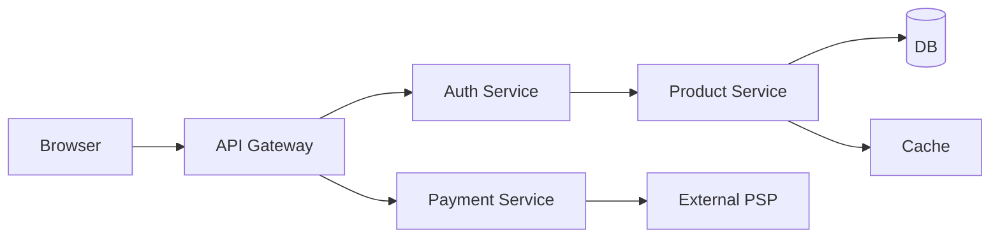
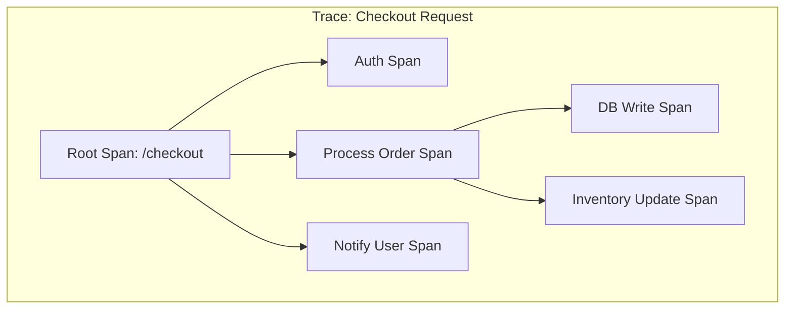

# Distributed Tracing

**Topic:** [[obs/overview]]
**Related:** [[obs/concepts/tempo-jaeger]], [[obs/concepts/opentelemetry]], [[obs/concepts/sampling]]

---

## Why Tracing Exists

A single user request in a microservices architecture touches dozens of services.



**Metrics** tell you that latency is high. **Logs** tell you what each service did. But neither tells you *which service in the call chain is responsible for the slowdown* or *how long each hop takes relative to others*.

---

## Core Concepts

### Trace vs Span
A **Trace** is the complete request journey. A **Span** is a single unit of work.



### Trace Visualization (Gantt Style)

```mermaid
gantt
    title Distributed Trace: POST /checkout
    dateFormat  X
    axisFormat %s ms

    section Gateway
    Root Span        :0, 250
    section Auth
    Auth Check       :10, 30
    section Product
    Get Product      :35, 80
    Redis Lookp      :36, 38
    section Payment
    External PSP Call :85, 240
    DB Write         :241, 247
```



### Trace
The complete record of one request's journey through the system.

```
Trace ID: 4bf92f3577b34da6a3ce929d0e0e4736
Duration: 252ms

[api-gateway        0ms → 252ms]  root span
├─ [auth-svc       10ms →  30ms]  20ms
├─ [product-svc    35ms →  80ms]  45ms
│  └─ [redis        36ms →  38ms]  2ms (cache hit)
└─ [payment-svc    85ms → 248ms]  163ms  ← BOTTLENECK
   ├─ [psp-api      90ms → 240ms]  150ms  ← EXTERNAL CALL
   └─ [db-write    241ms → 247ms]  6ms
```

### Span
One unit of work within a trace. Every span has:
- `trace_id` — links it to the trace
- `span_id` — unique within the trace
- `parent_span_id` — establishes the call hierarchy
- `name` — operation name (e.g., `"POST /checkout"`, `"db.query"`)
- `start_time`, `end_time`
- **Attributes (tags):** key-value pairs (`http.status_code=200`, `db.system=postgresql`)
- **Events:** timestamped log entries within the span
- **Status:** OK, ERROR, UNSET

### Context Propagation
The mechanism by which the trace and span IDs are passed from service to service.

Standard headers (W3C Trace Context):
```http
traceparent: 00-4bf92f3577b34da6a3ce929d0e0e4736-00f067aa0ba902b7-01
             ^^ version  ^^ trace_id (128bit)        ^^ span_id (64bit) ^^ flags
tracestate:  vendor1=value1,vendor2=value2
```

**Critical failure mode:** If a service doesn't forward these headers to its downstream calls, the trace is broken — the downstream spans appear as disconnected root traces. This is the most common tracing bug.

---

## Instrumentation

### Manual Instrumentation (OTel SDK)
```python
from opentelemetry import trace
from opentelemetry.trace.propagation.tracecontext import TraceContextTextMapPropagator

tracer = trace.get_tracer("checkout-service")

def process_checkout(order_id: str, request_headers: dict):
    # Extract parent context from incoming headers
    ctx = TraceContextTextMapPropagator().extract(request_headers)

    with tracer.start_as_current_span("process_checkout", context=ctx) as span:
        span.set_attribute("order.id", order_id)
        span.set_attribute("user.id", get_user_id())

        try:
            result = call_payment_service(order_id)
            span.set_attribute("payment.status", result.status)
            return result
        except Exception as e:
            span.record_exception(e)
            span.set_status(trace.StatusCode.ERROR, str(e))
            raise
```

### Auto-Instrumentation
OTel provides auto-instrumentation agents that wrap popular frameworks (FastAPI, Django, Flask, gRPC, SQLAlchemy, Redis, Kafka) with zero code changes:

```bash
# Python: use opentelemetry-instrument as a wrapper
opentelemetry-instrument \
  --traces_exporter otlp \
  --exporter_otlp_endpoint http://otel-collector:4317 \
  python app.py
```

Auto-instrumentation captures: HTTP requests/responses, DB queries (with anonymized SQL), cache operations, queue publishes/consumes, outbound HTTP calls.

---

## Sampling Strategies

The hardest production decision in tracing: you cannot trace every request at scale (Google handles ~10M QPS — 100% tracing is impossible).

| Strategy | How it works | Pros | Cons |
|---|---|---|---|
| **Head sampling** | Decide at trace start (sample 1%) | Zero overhead for non-sampled; simple | Misses rare errors in the 99% |
| **Tail sampling** | Buffer the trace; decide at end based on outcome | Can 100% sample errors, exceptions | Requires stateful buffer; complex |
| **Probabilistic** | 1-in-N requests | Simple, predictable storage | No bias toward interesting traces |
| **Rate limiting** | N traces/second regardless of load | Stable storage cost | Misses spikes |
| **Adaptive** | Adjust rate based on current load | Best of both | Complex to implement |

**Recommended for production:** Tail sampling via the OTel Collector's tail sampling processor — buffer 30 seconds, then sample: 100% for errors/slow requests, 1% for healthy requests.

Full deep dive: [[obs/concepts/sampling]]

---

## Trace Storage and Backends

| Backend | Storage | Query Language | Notes |
|---|---|---|---|
| **Tempo** (Grafana) | Object storage (S3/GCS) | TraceQL | Zero-dependency; integrates with Grafana |
| **Jaeger** | Elasticsearch / Cassandra | Jaeger UI | Original open-source leader |
| **Zipkin** | Various | Zipkin UI | Simpler; less feature-rich |
| **Datadog APM** | SaaS | Datadog | Managed; expensive; excellent UX |
| **AWS X-Ray** | SaaS | X-Ray | AWS-native; required for Lambda traces |

### TraceQL (Tempo)
```
# Find all traces where payment-svc took > 1 second
{resource.service.name="payment-svc" && duration > 1s}

# Find all traces with an error span in checkout
{span.status.code=error && resource.service.name="checkout-svc"}

# Find traces with a specific attribute
{span.http.url =~ ".*/api/checkout.*" && duration > 500ms}
```

Deep dive: [[obs/concepts/tempo-jaeger]]

---

## The Exemplars Bridge (Metrics ↔ Traces)

Prometheus supports **exemplars**: attaching a sample `trace_id` to a histogram bucket observation. This creates a direct link from a metric data point to the trace for that specific request.

```promql
# In Grafana: click a histogram spike → see exemplars → click trace_id → open in Tempo
```

This is the critical "metrics → trace → log" workflow that makes full observability possible:
1. Alert fires on p99 latency metric.
2. Inspect histogram in Grafana; find the spike; click an exemplar `trace_id`.
3. Open the trace in Tempo — see which span is slow.
4. In that span, click "View Logs" — Loki shows structured logs for that span's service, filtered by `trace_id`.
5. Root cause identified in 2 minutes instead of 2 hours.

---

## Interview Questions

**Q: What is the difference between a trace and a log?**
A: A log is a discrete event from a single service. A trace is the structured record of a request's journey across multiple services, with timing and causality. A log can contain a `trace_id` linking it to a trace.

**Q: Why do I sometimes see broken traces (disconnected spans)?**
A: A service in the call chain didn't propagate the `traceparent` header to its outbound calls. The downstream service creates a new root span, disconnecting the trace. Fix: ensure all HTTP clients and message consumers are instrumented to forward context headers.

**Q: How do you trace async/queue-based workflows?**
A: Inject the trace context into the message payload (a header or metadata field). The consumer extracts it and creates a child span linked to the producer span. OTel has built-in propagators for Kafka, SQS, and RabbitMQ.

**Q: What is sampling bias and why does it matter?**
A: If you sample 1% of traces uniformly, you have a 99% chance of missing any given error. Tail sampling solves this: buffer all traces for 30–60 seconds, then decide — sample 100% of traces that contain an error span, 1% of healthy traces. This gives full coverage of anomalies with predictable storage cost.

## Sources
- [[obs/concepts/tempo-jaeger]]
- [[obs/concepts/opentelemetry]]
- [[obs/concepts/sampling]]
- [[obs/sources/opentelemetry-spec]]
