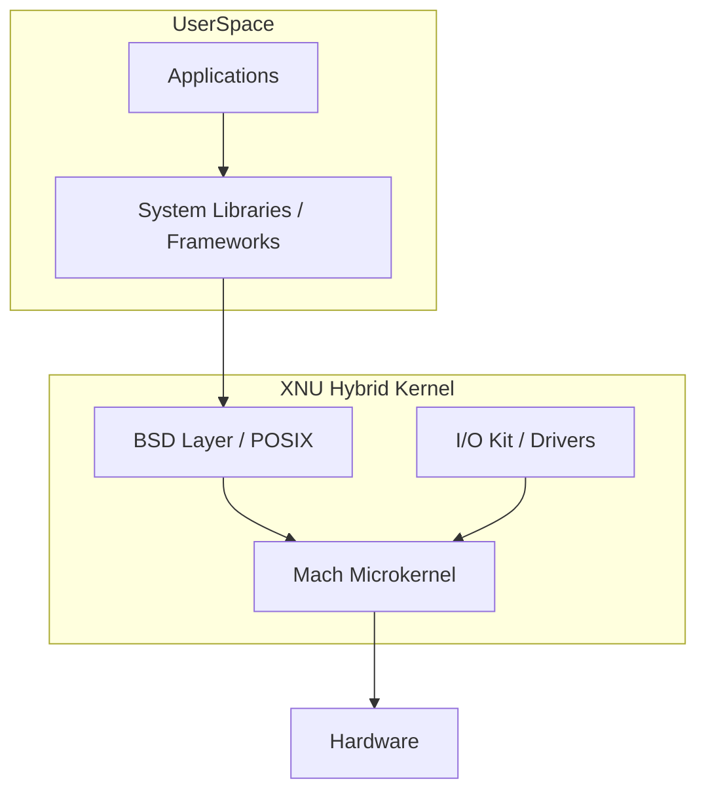

# Apple XNU & Darwin Internals

**Topic:** [[sre/topics/linux-cli]]
**Related:** [[sre/companies/apple]]

## Overview
While many Apple services run on Linux in the cloud, internal infrastructure and edge devices run on **XNU** ("X is Not Unix"). XNU is a hybrid kernel combining the **Mach** microkernel and components from **FreeBSD**.

## Key Concepts

### 1. Mach Microkernel
- **IPC (Inter-Process Communication):** Everything in Mach is a "port." Communication happens via message passing between ports.
- **Threads:** Mach manages low-level scheduling and thread primitives.
- **Memory Management:** Mach handles virtual memory, paging, and memory-mapped files.

### 2. BSD Layer
- Sits on top of Mach.
- Provides the POSIX API (files, processes, signals, sockets).
- Manages the networking stack and file system (APFS/HFS+).

### 3. Vnodes
- Unlike Linux's `inode`, Darwin uses `vnode` (virtual node) as the primary abstraction for files and directories.
- An SRE might be asked: "How does the kernel translate a file descriptor to a vnode?"

### 4. Grand Central Dispatch (GCD)
- Apple's solution for task-based concurrency (libdispatch).
- Instead of managing raw threads, developers/SREs manage "dispatch queues."

## SRE Troubleshooting on Darwin
- **`dtrace`:** The "gold standard" for tracing on macOS/Darwin (equivalent to `bpftrace` on Linux).
- **`fs_usage`:** High-level tool to see file system activity in real-time.
- **`scutil`:** Managing the System Configuration framework (network, hostname).
- **`launchd`:** Apple's replacement for `init`, `cron`, and `inetd`.

## Interview Angles
- "Explain the difference between a Mach port and a Unix socket."
- "How does `launchd` differ from `systemd`?"
- "What is the role of the `CommPage` in Darwin?"

## Sources
- [[sre/companies/apple]]
