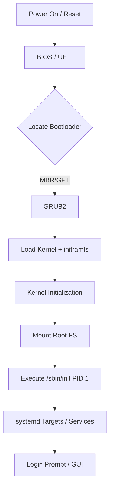

# Linux Boot Process

**Topic:** [[sre/topics/linux-cli]]
**Related:** [[sre/companies/apple]], [[sre/concepts/process-signals]]

## Overview
The sequence of events from power-on to a functional shell. Understanding this is critical for troubleshooting systems that won't start.

## The Stages

### 1. BIOS/UEFI
- **BIOS (Basic I/O System):** Performs POST (Power-On Self-Test). Locates the boot sector on the disk (MBR).
- **UEFI (Unified Extensible Firmware Interface):** Modern replacement. Loads `.efi` executables from an EFI System Partition (ESP).

### 2. Bootloader (GRUB2)
- Loads the kernel and the initial RAM disk (`initrd` or `initramfs`) into memory.
- Provides the boot menu to select kernel versions or recovery modes.

### 3. Kernel
- Initializes hardware drivers.
- Mounts the root file system as read-only.
- Executes the first process: `init` (PID 1).

### 4. Init System (systemd)
- `systemd` is the modern standard (replacing SysVinit).
- It manages targets (e.g., `multi-user.target`, `graphical.target`).
- Starts system services, mounts file systems from `/etc/fstab`, and configures networking.

## Interview Angles
- "What is the difference between `initrd` and `initramfs`?"
- "How do you recover a system with a corrupted GRUB configuration?"
- "What happens if PID 1 crashes?"

## Sources
- [[sre/companies/apple]]
