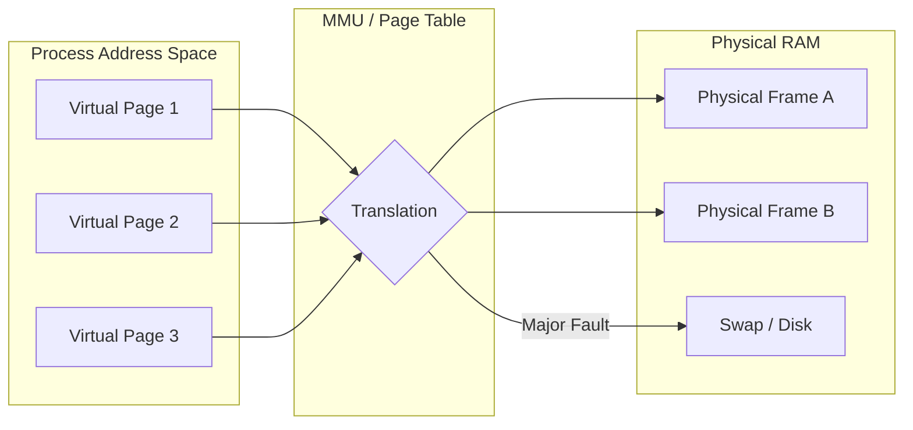

# Memory Management (Linux & SRE)

**Topic:** [[sre/topics/linux-cli]]
**Related:** [[sre/companies/apple]], [[sre/concepts/process-signals]]

## Overview
How the OS manages physical RAM and provides a virtualized view to processes. SREs care about this when debugging OOMs, leaks, and performance degradation.

## Key Concepts

### 1. Virtual Memory
- Each process has its own private address space.
- The **MMU (Memory Management Unit)** translates virtual addresses to physical RAM using **Page Tables**.

### 2. Paging & Page Faults
- **Page:** A fixed-size block (typically 4KB).
- **Minor Page Fault:** Page is in RAM but not mapped to the process.
- **Major Page Fault:** Page must be loaded from disk (swap or file-backed). High major faults indicate memory pressure.

### 3. Resident Set Size (RSS) vs. Virtual Size (VSZ)
- **RSS:** Actual physical memory the process is using.
- **VSZ:** Total virtual memory allocated, including shared libraries and swapped-out pages.

### 4. OOM Killer (Out of Memory)
- When RAM + Swap is exhausted, the kernel invokes the OOM Killer to sacrifice a process to save the system.
- Score is based on memory usage and `oom_score_adj`.

### 5. Copy-on-Write (COW)
- Used during `fork()`. The child process shares the parent's memory pages until one of them modifies a page, at which point a private copy is made.

## SRE Tools
- `free -m`: Overall memory usage.
- `vmstat 1`: Check swap in/out (`si`/`so`).
- `pmap -x <pid>`: Detailed memory map of a process.
- `dmesg | grep -i oom`: See which processes were killed.

## Sources
- [[sre/companies/apple]]
