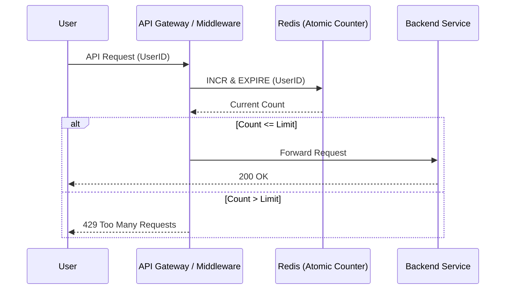

# Distributed Rate Limiter

**Difficulty:** Hard
**Topic:** [[sre/topics/system-design]]
**Pattern:** Token Bucket / Leaky Bucket
**Companies:** [[sre/companies/apple]], [[sre/companies/stripe]], [[sre/companies/google]]

## Problem
Design a system to limit the number of requests a user can make to an API across a distributed cluster of servers (e.g., 100 requests per minute).

## Approach



### 1. Algorithms
- **Token Bucket:** Fixed capacity bucket; tokens added at a constant rate. Request allowed if token available. (Best for bursting).
- **Leaky Bucket:** Requests enter a queue and are processed at a constant rate. (Best for smoothing traffic).
- **Fixed Window Counter:** Simple but has "edge of window" spikes.
- **Sliding Window Log/Counter:** Most accurate but memory intensive.

### 2. Architecture
- **Centralized Store:** Use **Redis** for storing counters. It's fast (in-memory) and supports atomic increments (`INCR`) and expirations.
- **Middleware:** The rate limiter sits as a sidecar or middleware in the API Gateway.

### 3. Distributed Challenges
- **Race Conditions:** Use Redis Lua scripts to ensure `GET` and `SET` operations are atomic.
- **Latency:** A central Redis can become a bottleneck. Use local caching (L1) with eventual consistency or sharded Redis.
- **Fault Tolerance:** If Redis is down, do we "fail open" (allow all) or "fail closed" (block all)? Usually, SREs prefer failing open to avoid impacting user experience.

## Solution (Redis + Lua)
```lua
-- Lua script for atomic token bucket
local key = KEYS[1]
local limit = tonumber(ARGV[1])
local window = tonumber(ARGV[2])

local current = redis.call("INCR", key)
if current == 1 then
    redis.call("EXPIRE", key, window)
end

if current > limit then
    return 0
else
    return 1
end
```

## Apple-Specific Considerations
- **Privacy:** Do not use UserID directly in the Redis key if it's PII. Use a salted hash.
- **Scale:** How does this handle a sudden spike from 100M devices? (Answer: Layered rate limiting — per-device, per-edge-node, and global).

## Complexity
- **Time:** O(1) per request (one Redis call).
- **Space:** O(U) where U is the number of active users in the time window.

## Key Insight
Atomic operations are critical in distributed systems. Always discuss what happens when the rate limiter itself is under high load.

## Sources
- [[sre/companies/apple]]
